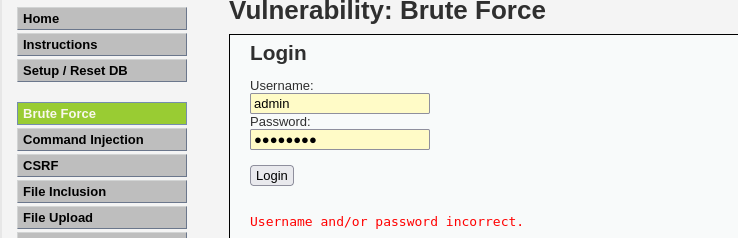
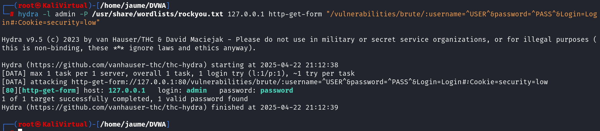

Esta sección permite simular un ataque de fuerza bruta sobre el inicio de sesión. En el nivel low, he hecho una prueba manual introduciendo combinaciones comunes de usuario y contraseña, observando cómo no había ningún tipo de protección, ni bloqueo por intentos ni retardo de respuesta.

Figura 4: Prueba de brute force manual
Luego, para automatizar el proceso, utilicé la herramienta Hydra con un diccionario de contraseñas. El comando nos permite hacer múltiples intentos en muy poco tiempo, explotando la falta de mecanismos de defensa ante este tipo de ataques. Y tras poco tiempo vemos que saca la contraseña adecuada, funciona tanto en low como médico.

Figura 5: Ejecución del comando hydra con diccionario

