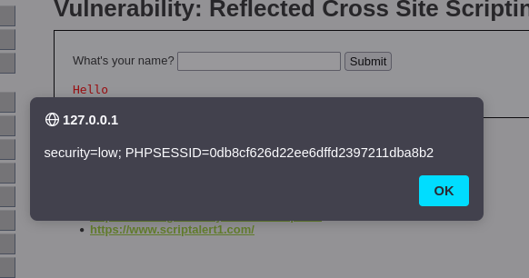
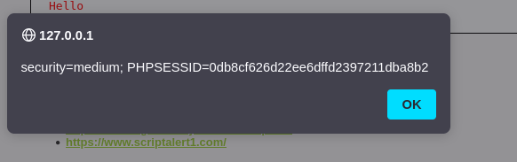

Este tipo de XSS refleja el payload directamente en la respuesta del servidor.

LOW | MEDIUM
En low, basta con escribir "" en un campo visible para que se ejecutará.

Figura 31: Tras escribir nuestro payload directamente

Lo mismo funciona con medium.

Figura 32: Funciona igual en medium

