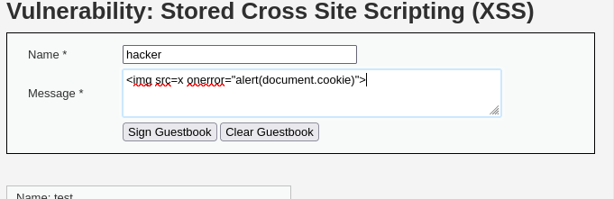
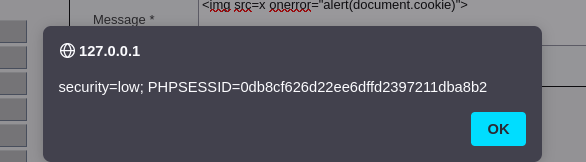
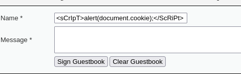
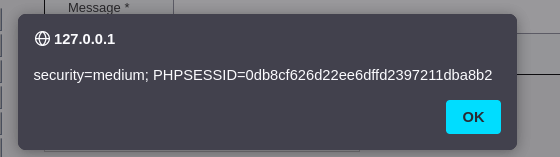

En el XSS almacenado, el código malicioso queda guardado en la base de datos y se ejecuta cada vez que alguien accede a ese contenido.

LOW

En low, introducimos el payload en el campo de descripción, y luego se ejecuta automáticamente al visitar la página.

Figura 33: Escribimos nuestro payload en la descripción

Figura 34: Payload ejecutado
MEDIUM

En médium, aunque había restricciones de longitud, modifiqué el valor desde el navegador usando "Inspeccionar elemento", y conseguimos inyectar el mismo código. 

Este tipo de XSS es especialmente peligroso porque afecta a todos los usuarios que visiten la página infectada.

Figura 35: Escribimos el payload en el nombre, simplemente “inspeccionando” modificamos el límite de caracteres

Figura 36: Exito
