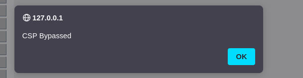

En esta sección el reto consistía en saltarse las políticas CSP.
LOW
En low, logré ejecutar JavaScript directamente.

Figura 37: Tras ejecutar un js directamente
MEDIUM
En Medium, necesitaba añadir un atributo nonce al script para que fuera permitido. Copié el valor del nombre desde el código fuente usando las herramientas del navegador, y lo utilicé en mi payload, logrando ejecutar un alerta(document.cookie).

Figura 38: En inspeccionar tenemos que copiar el nombre.
Esto demuestra cómo incluso una política CSP mal aplicada puede ser burlada si el atacante accede al código fuente.

