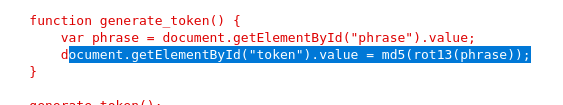
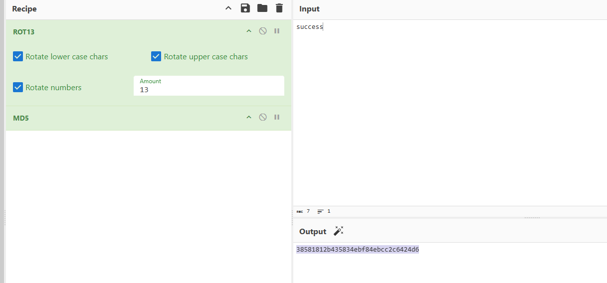
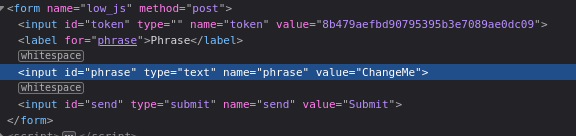
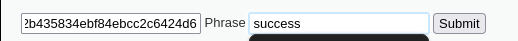
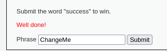
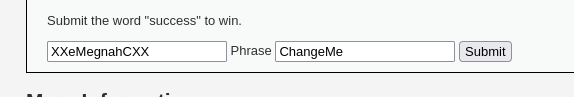

En esta sección exploramos ataques que se pueden hacer solo con JS y manipulación del frontend.
LOW

En low, vemos que el sistema cifraba una palabra con ROT13 y luego MD5. 

Figura 39: Vemos que lo que hace el un cifrado rot13 y después md5.
Usando herramientas online, sacamos el hash correcto y conseguimos modificar el token en el navegador  y escribir success para validar como "success".

Figura 40: Ciframos success con el cifrado correspondiente en una web

Figura 41: Hacemos visible el token

Figura 42: Modificamos el token con el de success y escribimos success

Figura 43: Exito
MEDIUM

En Medium, el token era la palabra "changeme" al revés, encerrada entre dos xx. Una vez cambiamos el token en el navegador, el sistema acepta el valor como válido. Esto demuestra lo inseguro que puede ser confiar en validaciones realizadas únicamente en el cliente.

Figura 44: Haciendo visible el token vemos que es solo changeme al revés entre dos double x

Figura 45: Escribimos como token xxsseccusxx y success

Figura 46: Exito

