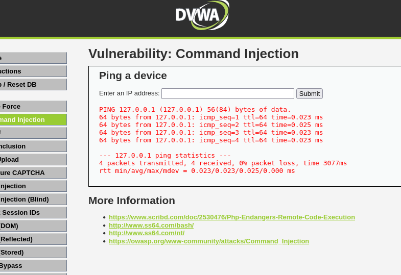
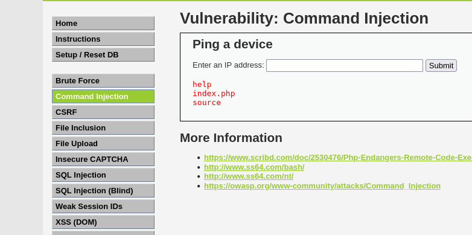

LOW | MEDIUM
Esta vulnerabilidad aparece cuando los datos introducidos por el usuario se ejecutan directamente en el sistema operativo sin una validación previa.

En el nivel low, vemos que se puede inyectar comandos junto con el ping, como por ejemplo “| ls” y obtener la salida de los directorios.

Esto funciona tanto en low como en medium

Figura 6: Prueba de ping

Figura 7: Inyección de comando |ls
