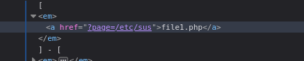
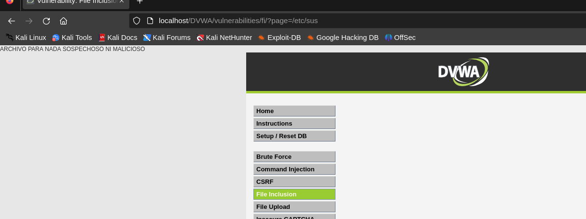

Esta vulnerabilidad consiste en que la aplicación permite incluir archivos externos sin validar correctamente la ruta.
LOW | MEDIUM
En el nivel low, modifiqué la URL para apuntar a rutas con archivos sospechosos y así acceder a archivos del sistema.

Figura 9: Cmabio de la dirección a la que accede el archivo

En el nivel medium funciona de la misma manera.

Figura 10: Archivo malicioso abierto correctamente
