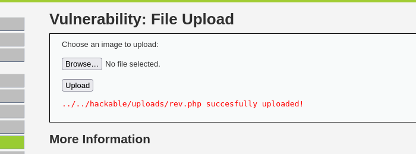
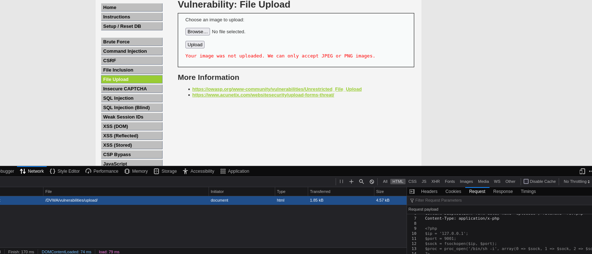

En esta parte aprovechamos la posibilidad de subir archivos al servidor.

LOW
En el nivel low, simplemente subimos un archivo .php con una reverse shell. Al acceder al archivo desde la URL, se ejecuta el código y conseguimos acceso remoto al servidor con netcat.

Figura 11: Archivo php que vamos a subir donde nos abre un reverse shell

Figura 12: Archivo subido

Figura 13: Acceso al archivo a través de url

Figura 14: Reverse shell abierta

MEDIUM
En Medium, el sistema bloqueaba archivos .php, así que utilicé el truco de cambiar el encabezado Content-Type a imagen/ping desde la pestaña de red del navegador (usando "Edit and Resend").

Figura 15: Cambiamos en inspeccionar el tipo de archivo que estamos subiendo

Eso nos permite subir el archivo igualmente, y al visitarlo desde la URL, se abre la reverse shell sin problema.

Figura 16: Cambio de php a png y nos deja subirlo al reenviar

Figura 17: Reverse shell abierta
