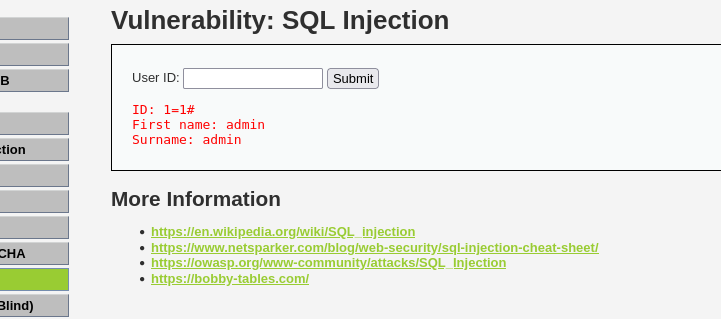
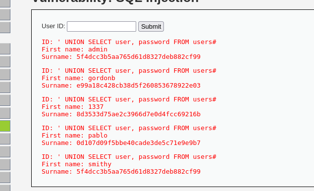
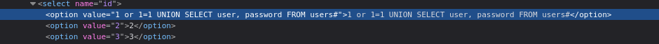
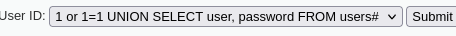
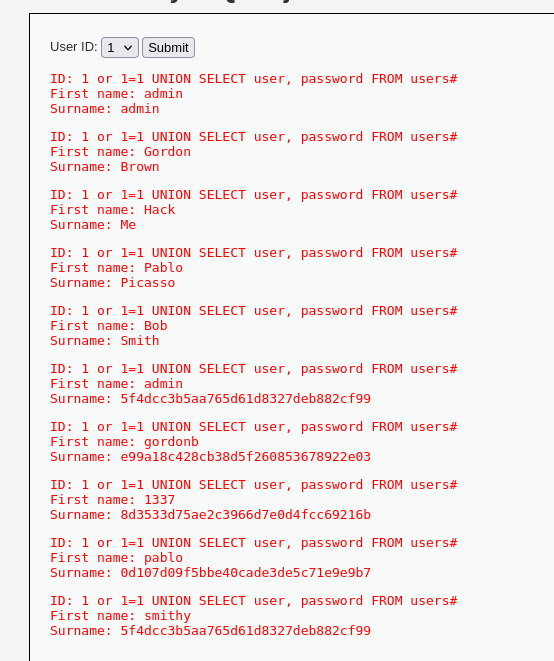

En esta sección me enfrenté a una típica inyección SQL donde intentamos inyectar una consulta sql no intencionada.
LOW
En el nivel low, basta con introducir ' or 1=1 -- en el campo de ID para obtener la lista completa de usuarios.

Figura 18: Id 1 

Figura 19: Inyección de consulta para ver los usuarios
MEDIUM
En Medium, el input estaba algo más filtrado, así que usé las herramientas de desarrollo del navegador para modificar el valor enviado y añadir mi payload manualmente. Esto nos permite ver igualmente la información de la base de datos, demostrando que la validación en el cliente no es suficiente.

Figura 20: Modificamos desde inspeccionar el valor de la opción 1 con nuestro payload

Figura 21: payload

Figura 22: Muestra de los usuarios 
