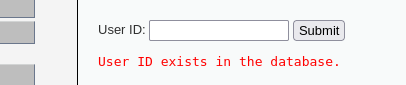
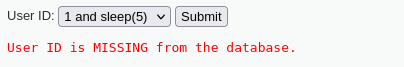

La inyección SQL ciega es una variante en la que no obtenemos directamente el resultado de la consulta.
LOW | MEDIUM
En low, al introducir valores como 1 and sleep(5), pude comprobar que el servidor se quedaba pensando, lo que indicaba que el payload había sido interpretado.

En Medium, el comportamiento fue similar, aunque con una validación algo más estricta que igualmente podemos evadir con payloads más sutiles. Este tipo de vulnerabilidad demuestra cómo incluso sin respuesta directa, se puede sacar información del sistema.

Figura 23: Prueba de escribir 1

Figura 24: Tras escribir nuestro payload “1 and sleep(5)”

