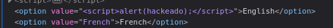
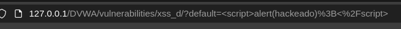
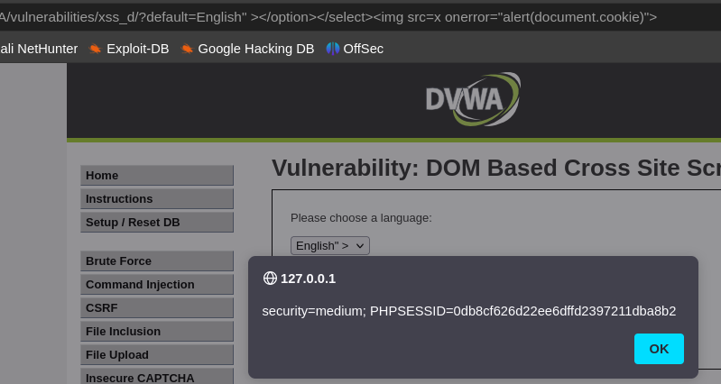

Esta forma de XSS se basa en cómo el navegador interpreta el DOM.
LOW

En el nivel low, simplemente inyectar código JavaScript en la opción de idioma (?default=english">) y se ejecutó.

Figura 28: Añadimos el payload a la opción english

Figura 29: tras seleccionar la opción english con nuestro payload

MEDIUM
En medium, utilicé un payload más elaborado para evitar validaciones, insertando una etiqueta  con un onerror, que nos permite ejecutar un alert(document.cookie), ignorando la validación de image tag, demostrando la ejecución de código en el navegador de la víctima.

Figura 30: Tras hacer lo mismo pero con un payload distinto para saltarse la comprobación de que sea imagen, payload _“" ></option></select>”_
